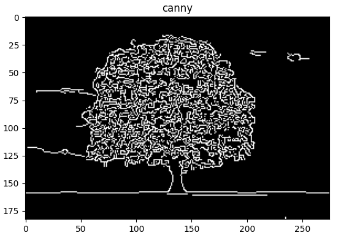

# Edge Detection 

1- Write a program to read an image and find the edges using:
- a) Sobel edge detection mask; vertical edge, horizontal edge,
magnitude
- b) Prewitt edge detection mask; vertical edge, horizontal edge,
magnitude
- c) Canny edge detection

Sobel, Prewitt, and Canny edge detection are three different algorithms used for detecting edges in an image. Here's a brief overview of the differences between these three algorithms:

1. Sobel Edge Detection:

Sobel edge detection is a common algorithm used for detecting edges in an image. It uses two kernels to apply a convolution operation on the image, one for detecting vertical edges and the other for detecting horizontal edges. The magnitude of the edge is then calculated as the square root of the sum of the squares of the vertical and horizontal edge strengths. Sobel edge detection is simple to implement and is effective at detecting edges in images.

outPut :
- 

2. Prewitt Edge Detection:

Prewitt edge detection is similar to Sobel edge detection, but it uses a different kernel for detecting edges. The Prewitt kernel is simpler than the Sobel kernel, and it is faster to compute. Prewitt edge detection is also effective at detecting edges in images, but it may not be as accurate as Sobel edge detection.

outPut :
- 

3. Canny Edge Detection:

The Canny edge detection algorithm is a multi-stage process that involves smoothing the image with a Gaussian filter, computing the gradient magnitude and direction, applying non-maximum suppression to thin the edges, and finally, applying hysteresis thresholding to detect the edges. Canny edge detection is more complex than Sobel and Prewitt edge detection, but it is generally more accurate and reliable. Canny edge detection is often used for high-precision edge detection applications.

outPut :
- 

- In summary, Sobel and Prewitt edge detection are simpler algorithms that are effective at detecting edges in images, while Canny edge detection is a more complex algorithm that is more accurate and reliable, but also more computationally expensive. The choice of which algorithm to use depends on the specific application and the trade-off between accuracy and computation time.
