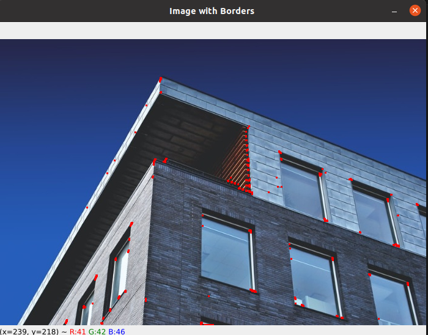

# Harris corner detection.

The Harris corner detection algorithm works by calculating the variation of intensity for small shifts in all directions in a local neighborhood of each pixel. The algorithm then computes the eigenvalues of a matrix that is constructed from these intensity variations. The eigenvalues are used to determine whether the pixel corresponds to a corner, an edge, or a flat region.

Here's a high-level overview of the Harris corner detection algorithm:

    1- Convert the image to grayscale.

    2-Compute the horizontal and vertical derivatives of the image using a Sobel operator.

    3- Compute the products of the horizontal and vertical derivatives of the image at each pixel.

    4- Compute the sum of the products of the derivatives in a local neighborhood of each pixel.

    5- Construct a matrix M from the sums of products of derivatives.

    6- Compute the eigenvalues of the matrix M.

    7- Use the eigenvalues to determine whether the pixel corresponds to a corner, an edge, or a flat region.

    8- Threshold the eigenvalues to obtain the corner points.
    

### input image :

### output image: